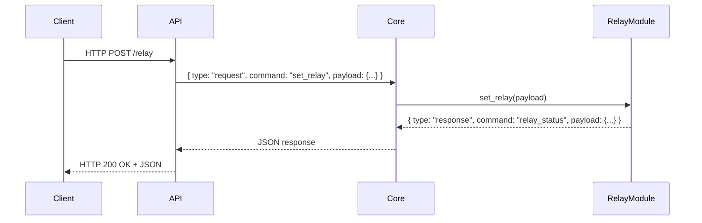

---

# 🦉 Guiver – Message Processing Flow

---

# 1. 🏛️ Architectural Overview

Guiver segue un’architettura modulare costruita attorno a un componente centrale: il **Core**.

Il Core si occupa di:

* 📥 Ricevere richieste dalle interfacce (REST API, WebSocket, ecc.)
* ✅ Validare la struttura dei messaggi
* 🔀 Instradare le richieste al modulo appropriato
* 📊 Raccogliere le risposte dai moduli
* 📤 Inviare le risposte all’interfaccia di origine

Il Core funge da:

* 🛣️ Router dei messaggi
* 🧩 Coordinatore logico
* ⚡ Livello di decoupling tra interfacce e moduli

---

# 2. 🏃‍♂️ Processing Flow

Il flusso di elaborazione dei messaggi segue questi passi:

1. 🖥️ L’interfaccia riceve una richiesta da un client
2. 🔧 L’interfaccia costruisce un messaggio interno standardizzato
3. 🗂️ Il Core riceve e analizza il messaggio
4. 📨 Il Core instrada la richiesta al modulo appropriato
5. ⚙️ Il modulo elabora la richiesta
6. 📄 Il modulo restituisce una risposta standardizzata
7. 🔄 Il Core inoltra la risposta all’interfaccia
8. 📨 L’interfaccia restituisce la risposta al client

---

# 3. 📝 Standard Message Structure

## Request

```json
{
  "type": "request",
  "command": "command_name",
  "payload": {}
}
```

## Response

```json
{
  "type": "response",
  "command": "command_name",
  "payload": {}
}
```

### Rules 📌

* `type` definisce se il messaggio è una richiesta o una risposta
* `command` identifica l’azione o il modulo
* `payload` contiene i dati necessari per l’elaborazione

---

# 5. 🔄 Message Flow Diagram

```
+-------------+        +--------+        +---------------+
|   Client    | -----> |  API   | -----> |     Core      |
+-------------+        +--------+        +---------------+
                                              |
                                              |
                                              v
                                       +--------------+
                                       | Relay Module |
                                       +--------------+
                                              |
                                              |
                                              v
+-------------+        +--------+        +---------------+
|   Client    | <----- |  API   | <----- |     Core      |
+-------------+        +--------+        +---------------+
```

---

# 6. 📊 Sequence Diagram (Mermaid)



---

# 8. 🎭 System Roles

## 🌐 Interface Layer (API / WebSocket)

Responsabilità:

* 🔄 Tradurre le richieste esterne in messaggi interni standardizzati
* 📨 Restituire le risposte al client
* ⚙️ Non contenere logica hardware
* 🛡️ Rimanere indipendente dai dettagli dei moduli

---

## 🧠 Core

Responsabilità:

* 🔀 Routing dei comandi
* 📇 Gestione del registro dei moduli
* ✅ Applicazione del formato dei messaggi
* 🤝 Coordinamento tra interfacce e moduli

Il Core è l’elemento centrale del sistema.

---

## 🛠️ Modules

Responsabilità:

* ⚡ Implementare logica specifica di business o hardware
* 🔌 Gestire interazioni con hardware o servizi
* 📄 Restituire sempre oggetti risposta strutturati

I moduli devono essere:

* 🧩 Indipendenti
* 🔌 Plug-and-play
* ⚡ Decoupled dalla logica delle interfacce

---

# 9. ✨ Architectural Benefits

* 🔗 Decoupling completo tra interfacce e moduli
* ➕ Facilmente estendibile
* 📏 Protocollo interno standardizzato
* 🔄 Flusso di messaggi chiaro
* 🏗️ Architettura modulare e manutenibile

---
