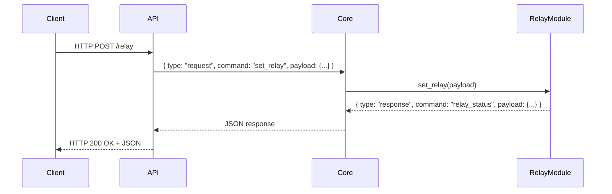

---

# Guiver – Message Processing Flow 🚀

---

# 1. Architectural Overview 🏗️

Guiver follows a modular architecture built around a central **Core** component.

The Core is responsible for:

* Receiving requests from interfaces (REST API, WebSocket, etc.) 📡
* Validating message structure ✅
* Routing requests to the appropriate module 🔀
* Collecting module responses 📥
* Sending responses back to the originating interface 📤

The Core acts as:

* A message router 🛣️
* A logical coordinator 🧩
* A decoupling layer between interfaces and modules 🔧

---

# 2. Processing Flow 🔄

The message processing flow follows these steps:

1. An interface receives a request from a client 🖥️
2. The interface builds a standardized internal message 📝
3. The Core receives and parses the message 🔍
4. The Core routes the request to the appropriate module ➡️
5. The module processes the request ⚙️
6. The module returns a standardized response 📦
7. The Core forwards the response to the interface 🔁
8. The interface returns the response to the client ✅

---

# 3. Standard Message Structure 📑

## Request

```json
{
  "type": "request",
  "command": "command_name",
  "payload": {}
}
```

## Response

```json
{
  "type": "response",
  "command": "command_name",
  "payload": {}
}
```

### Rules 📌

* `type` defines whether the message is a request or a response
* `command` identifies the action or module
* `payload` contains the data required for processing

---

# 5. Message Flow Diagram 🖼️

```
+-------------+        +--------+        +---------------+
|   Client    | -----> |  API   | -----> |     Core      |
+-------------+        +--------+        +---------------+
                                              |
                                              |
                                              v
                                       +--------------+
                                       | Relay Module |
                                       +--------------+
                                              |
                                              |
                                              v
+-------------+        +--------+        +---------------+
|   Client    | <----- |  API   | <----- |     Core      |
+-------------+        +--------+        +---------------+
```

---

# 6. Sequence Diagram (Mermaid) ⏱️



---

# 8. System Roles 🎭

## Interface Layer (API / WebSocket) 🌐

Responsibilities:

* Translate external requests into standardized internal messages 🔄
* Return responses to the client 📤
* Contain no hardware logic ❌⚡
* Remain independent from module implementation details 🧩

---

## Core 🏛️

Responsibilities:

* Command routing 🛤️
* Module registry management 📋
* Message format enforcement 📝
* Coordination between interfaces and modules 🤝

The Core is the central element of the system.

---

## Modules 🧱

Responsibilities:

* Implement specific business or hardware logic ⚙️
* Handle hardware or service interactions 🔌
* Always return structured response objects 📦

Modules must be:

* Independent 🆓
* Plug-and-play 🔌
* Decoupled from interface logic 🧩

---

# 9. Architectural Benefits ✨

* Full decoupling between interfaces and modules 🔄
* Easy extensibility 🛠️
* Standardized internal protocol 📑
* Clear message flow 🧭
* Modular and maintainable architecture 🏗️

---
